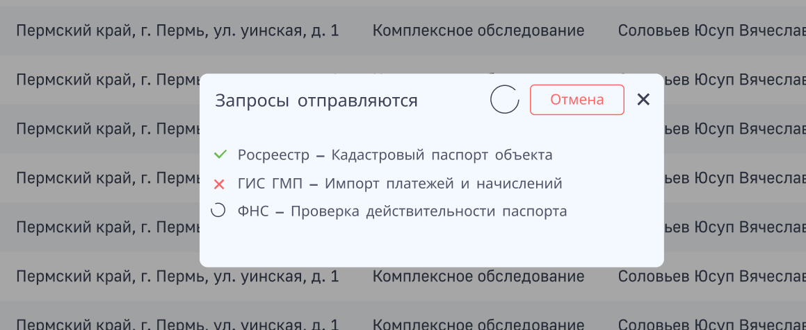
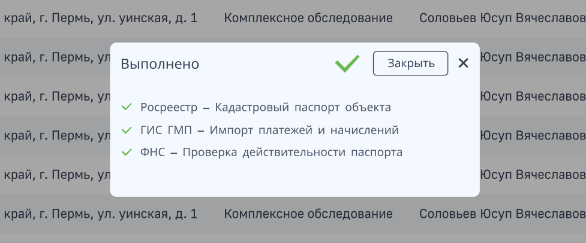

## Диалоги с пользователем

В системе предполагается использование следующих основных способов общения между пользователем и системой:

* Модальные окна
* Всплывающие уведомления
* Всплывающие подсказки (hint)

## Описание модального окна

В графическом интерфейсе пользователя модальным называется окно, которое блокирует работу пользователя с родительским приложением до тех пор, пока пользователь не закроет это окно. Модальными преимущественно реализованы диалоговые окна. Также модальные окна часто используются для привлечения внимания пользователя к важному событию или критической ситуации.

Модальное окно должно иметь определенную структуру, примерно, как на картинке ниже:

[Изменить]: # (Как минимум два варианта выходов)
У него может быть несколько выходов (минимум 2):

* Кнопка отмены.
* Крестик в углу.
* По нажатию клавиши Esc.
* При нажатии на свободное пространство вне модального окна.

Кроме того, важно учитывать, что его размеры не должны превышать 50% от пространства всего пользовательского интерфейса, а наименование кнопки целевого действия должно совпадать с заголовком модального окна.

[Измененить]: # (Изменить заголовок "Использование модального окна" на Применение)
## Применение модального окна

Модальные окна необходимо показывать в *редких* случаях, *чаще всего,* когда пользователь совершает критическое действие, например, удаляет что-то или вносит значительные изменения. *Не следует использовать его для отображения сообщений об ошибке или успешно выполненном действии. В противном случае пользователь приучится автоматически подтверждать свои действия.*

Ярким примером необходимости использования модального окна является удаление объектов.
При удалении объектов должен выполняться ряд правил:

* Автоматический фокус на кнопке подтверждения должен быть убран
* Информация должна выводиться не только о том, что объекты удаляются, но и о их свойствах и последствиях (особенно в случае, если объекты восстановлению не подлежат)
* Должно быть наличие возможности выхода из неприятного для пользователя состояния

Как это происходит сейчас:

Явный недочет в том, что пользователь не знает точно, что удаляет, поэтому и подтвердить это действие ему проще. Необходимо уведомить пользователя о том, какой объект удаляется и какие последствия это вызовет (в данном примере: невозможность восстановить удаляемый объект)

На этом диалоговом окне присутствует информация об удаляемом объекте, предупреждение об отсутствии обратной силы у данного действия, фокус на кнопке «Нет», а также крестик, который позволит безболезненно выйти из "неприятного состояния" в случае необходимости.

Также, хорошим тоном использования модального окна может быть выполнение сложной массовой операции. В таком случае модальное окно может не только предупреждать о чем-то, но и выводить информацию о статусе каждой отдельной операции:

Во время вывода такого модального кона взаимодействие с системой приостанавливается до полного выполнения (успешного или неуспешного) всех операций. После чего пользователь может закрыть модальное окно и продолжить работу.

[Добавить]: # (Добавить заголовок для хинтов и перенести их выше до применения)

## Описание всплывающего уведомления
[Добавить]: # (Добавить описание всплывающего окна, что это и как с ним работать)
Всплывающее окно – небольшое окно уведомления, которое обычно появляется в правом нижнем углу экрана, которое не останавливает процесс взаимодейсвтия с активным приложением. 

Структура всплывающего уведомления

Также основным свойством всплывающего окна является возможность не закрывать его, по той причине, что по истечении определенного времени они исчезают самостоятельно. Несмотря на это свойство, всплывающее окно возможно закрыть крестиком в правом верхнем углу.

## Применение всплывающего уведомления

Использовать всплывающие окна рекомендуется в случаях, когда необходимо уведомить пользователя о чем-то, например, при выведении информации о количестве удаленных строк.

Как есть (модальное окно):
 

Как должно быть (всплывающее уведомление):

 
Чтобы пользователь мог продолжать непрерывную работу, достаточно просто показать во всплывающем окошке нужную информацию. Оно остается на экране пользователя либо до момента «смахивания», либо пока не исчезнет самостоятельно.

## Описание всплывающей подсказки 
Помимо модальных окон и уведомлений должны существовать всплывающие подсказки, которые возникают при наведении на объект, если взаимодействие с ним имеет ограничения или взаимодействие с ним неочевидно. 

Структура всплывающей подсказки:

 
 ## Применение всплывающей посказки
 
При регистрации поле для ввода пароля имеет набор ограничений, чтобы пользователю не пришлось заполнять форму несколько раз, необходимо вывести всплаывющую подсказку при навежении

 
Другой пример – когда кнопка выполняет неочевидное дейсвтие, о котором нужно предупредить пользователя

